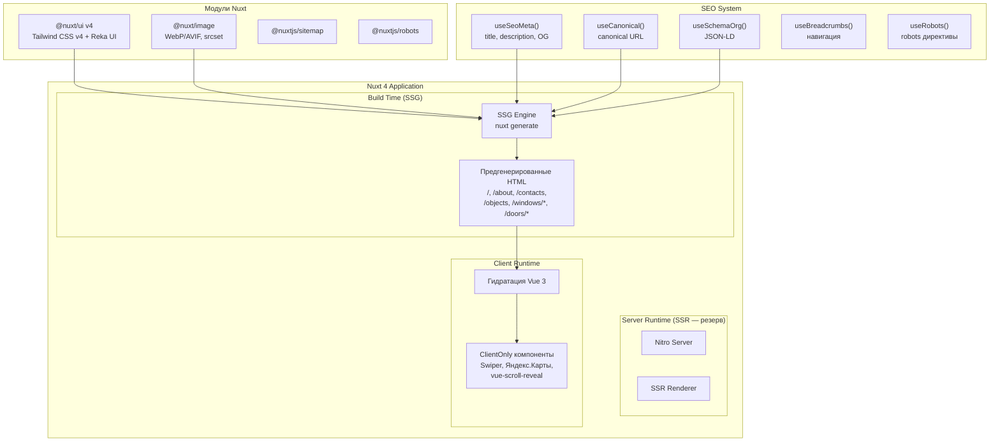
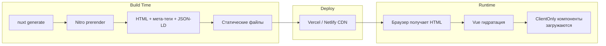

# Дизайн-документ: Миграция Vue 3 SPA → Nuxt 4 (SSG-first)

## Обзор

Данный документ описывает техническую архитектуру миграции коммерческого сайта компании по производству алюминиевых окон и дверей с Vue 3 SPA (Vite + vue-router + GitHub Pages) на Nuxt 4 с SSG/prerender для всех текущих публичных маршрутов. SSR остаётся доступным через routeRules для будущих динамических секций. Миграция охватывает: смену фреймворка (Vue 3 → Nuxt 4), смену UI-системы (Bootstrap 5 + PrimeVue 3 → Nuxt UI v4), внедрение SSG для SEO, оптимизацию Core Web Vitals, и перенос деплоя с GitHub Pages на SSR-совместимую платформу.

### Ключевые решения

- **Фреймворк**: Nuxt 4 (стабильный релиз) с SSG/prerender для всех текущих маршрутов; SSR доступен через routeRules при необходимости
- **UI-система**: Nuxt UI v4 (@nuxt/ui) + Tailwind CSS v4 + Reka UI
- **Рендеринг**: SSG/prerender для всех текущих публичных маршрутов (контент статичен); SSR остаётся доступным через routeRules для будущих динамических секций
- **Деплой**: Vercel или Netlify (SSR-совместимая платформа)
- **SEO**: useSeoMeta() + кастомные composables (useCanonical, useSchemaOrg, useBreadcrumbs, useRobots)
- **Миграция**: 5 фаз с поддержкой legacy-слоя Bootstrap на переходном этапе

### Исследование: Nuxt 4 и Nuxt UI v4

**Nuxt 4** — актуальная ветка фреймворка. Ключевые отличия от Nuxt 3:

- Директория `app/` как корень приложения (вместо корня проекта)
- Обновлённая структура: `app/pages/`, `app/components/`, `app/composables/`, `app/layouts/`
- Совместимость с Vue 3 Composition API, Pinia, TypeScript
- Встроенная поддержка гибридного рендеринга через `routeRules`

**Nuxt UI v4** — 125+ компонентов на базе Reka UI (headless) + Tailwind CSS v4:

- Требует Nuxt 4
- Обёртка `<UApp>` обязательна в `app/app.vue` для Toast, Tooltip, programmatic overlays
- Встроенная accessibility-поддержка через Reka UI
- Компоненты: UButton, UInput, UTextarea, UModal, UDrawer, UNavigationMenu, UDropdownMenu, UCard, UTable, UTabs и др.

**Совместимость библиотек с SSR**:

- Swiper 11: требует `<ClientOnly>` (обращается к `window`)
- vue-yandex-maps: требует `<ClientOnly>` (Яндекс.Карты API — browser-only)
- vue-scroll-reveal: требует клиентского плагина (зависит от DOM)
- Pinia: встроенная интеграция в Nuxt 4, миграция без изменений
- Bootstrap JS: загрузка только на клиенте через плагин с режимом `client`

## Архитектура

### Общая архитектура системы



### Матрица рендеринга

| Маршрут             | Режим            | Обоснование                                 |
| ------------------- | ---------------- | ------------------------------------------- |
| `/`                 | SSG (prerender)  | Статичный контент, максимальная скорость    |
| `/about`            | SSG (prerender)  | Статичный контент                           |
| `/contacts`         | SSG + ClientOnly | Статичный контент + Яндекс.Карты на клиенте |
| `/objects`          | SSG (prerender)  | Портфолио — статичная галерея               |
| `/windows`          | SSG (prerender)  | Каталог — контент обновляется редко         |
| `/windows/classic`  | SSG (prerender)  | Статичный контент продукции                 |
| `/windows/panorama` | SSG (prerender)  | Статичный контент продукции                 |
| `/windows/hidden`   | SSG (prerender)  | Статичный контент продукции                 |
| `/doors`            | SSG (prerender)  | Каталог — контент обновляется редко         |
| `/doors/hd`         | SSG (prerender)  | Статичный контент продукции                 |
| `/doors/classic`    | SSG (prerender)  | Статичный контент продукции                 |
| `/doors/balcony`    | SSG (prerender)  | Статичный контент продукции                 |

### Архитектура рендеринга

Все текущие публичные маршруты используют SSG/prerender — контент генерируется на этапе сборки. SSR остаётся доступным через `routeRules` для будущих динамических секций без изменения архитектуры.



## Компоненты и интерфейсы

### Файловая структура проекта (Nuxt 4)

```
project-root/
├── app/
│   ├── app.vue                    # Корневой компонент с <UApp>
│   ├── pages/
│   │   ├── index.vue              # / (главная)
│   │   ├── about.vue              # /about
│   │   ├── contacts.vue           # /contacts
│   │   ├── objects.vue            # /objects
│   │   ├── windows/
│   │   │   ├── index.vue          # /windows (хаб-страница каталога окон, индексируемая)
│   │   │   ├── classic.vue        # /windows/classic
│   │   │   ├── panorama.vue       # /windows/panorama
│   │   │   └── hidden.vue         # /windows/hidden
│   │   └── doors/
│   │       ├── index.vue          # /doors (хаб-страница каталога дверей, индексируемая)
│   │       ├── hd.vue             # /doors/hd
│   │       ├── classic.vue        # /doors/classic
│   │       └── balcony.vue        # /doors/balcony
│   ├── layouts/
│   │   └── default.vue            # Navbar + Footer + <slot />
│   ├── components/
│   │   ├── AppNavbar.vue          # Навигация на Nuxt UI
│   │   ├── AppFooter.vue          # Футер на Nuxt UI
│   │   ├── AppBreadcrumbs.vue     # Хлебные крошки
│   │   ├── ContactBlock.vue       # Блок контактов
│   │   ├── ContactForm.vue        # Форма обратной связи
│   │   ├── DirectionWork.vue      # Направления работы (desktop)
│   │   ├── DirectionWorkMobile.vue # Направления работы (mobile)
│   │   ├── MiniAbout.vue          # Краткое описание компании
│   │   ├── ObjectsGallery.vue     # Галерея объектов
│   │   ├── PartnerBlock.vue       # Блок партнёров
│   │   ├── ProductTabs.vue        # Табы каталога (окна/двери)
│   │   ├── ProductCard.vue        # Карточка продукции
│   │   └── SliderHero.vue         # Главный слайдер (ClientOnly)
│   ├── composables/
│   │   ├── useCanonical.ts        # Canonical URL
│   │   ├── useSchemaOrg.ts        # JSON-LD schema.org
│   │   ├── useBreadcrumbs.ts      # Хлебные крошки
│   │   ├── useRobots.ts           # Robots директивы
│   │   └── useSiteConfig.ts       # Конфигурация сайта (defaults)
│   └── assets/
│       ├── css/
│       │   └── legacy.scss        # Legacy-стили на переходном этапе
│       └── images/                # Обрабатываемые изображения
├── server/
│   └── api/                       # API-эндпоинты (при необходимости)
├── public/
│   ├── favicon.ico
│   └── images/                    # Статические изображения
├── nuxt.config.ts
├── tailwind.config.ts             # Опционален: не требуется для базовой настройки Nuxt UI v4 (CSS-импорты достаточны); создавать только при необходимости глубокой кастомизации тем или токенов
├── tsconfig.json
└── package.json
```

### Маппинг компонентов: Vue 3 SPA → Nuxt 4

| Текущий компонент               | Новый компонент                                                                                                    | Изменения                               |
| ------------------------------- | ------------------------------------------------------------------------------------------------------------------ | --------------------------------------- |
| `src/App.vue`                   | `app/app.vue`                                                                                                      | Обёртка `<UApp>`, убран loader          |
| `NavbarElement.vue` (Bootstrap) | `AppNavbar.vue` (Nuxt UI)                                                                                          | UNavigationMenu, UDropdownMenu, UButton |
| `Footer.vue` (Bootstrap)        | `AppFooter.vue` (Nuxt UI)                                                                                          | Tailwind CSS v4                         |
| `SliderElement.vue` (Swiper)    | `SliderHero.vue` (ClientOnly + Swiper)                                                                             | `<ClientOnly>` обёртка                  |
| `ContactBlock.vue`              | `ContactBlock.vue` + `ContactForm.vue`                                                                             | UInput, UTextarea, UButton              |
| `DirectionWork.vue`             | `DirectionWork.vue`                                                                                                | Nuxt UI карточки                        |
| `DirectionWorkMobile.vue`       | Планируемая консолидация в единый responsive-компонент; временно сохраняется mobile-реализация на переходном этапе | Mobile-first через Tailwind breakpoints |
| `MiniAbout.vue`                 | `MiniAbout.vue`                                                                                                    | Tailwind CSS v4                         |
| `ObjectsDevelopment.vue`        | `ObjectsGallery.vue`                                                                                               | NuxtImg, галерея                        |
| `TypeWindow/*.vue`              | `pages/windows/*.vue`                                                                                              | Файловая маршрутизация                  |
| `TypeDoors/*.vue`               | `pages/doors/*.vue`                                                                                                | Файловая маршрутизация                  |
| `PartnerElement.vue`            | `PartnerBlock.vue`                                                                                                 | Tailwind CSS v4                         |
| `mobilePhone.vue`               | Убран (интегрирован в layout)                                                                                      | Sticky CTA в AppNavbar                  |
| `ButtonPurple.vue`              | UButton (Nuxt UI)                                                                                                  | Замена на стандартный компонент         |
| `useModalStore` (Pinia)         | `useModalStore` (Pinia)                                                                                            | Без изменений, встроенная интеграция    |

### Ключевые компоненты

#### app/app.vue

```vue
<template>
  <UApp>
    <NuxtLayout>
      <NuxtPage />
    </NuxtLayout>
  </UApp>
</template>
```

Обёртка `<UApp>` обязательна для Nuxt UI v4 — обеспечивает работу Toast, Tooltip и programmatic overlays.

#### app/layouts/default.vue

```vue
<template>
  <div class="min-h-screen flex flex-col">
    <AppNavbar />
    <main class="flex-1">
      <slot />
    </main>
    <AppFooter />
  </div>
</template>
```

#### app/components/AppNavbar.vue

Замена Bootstrap navbar на Nuxt UI:

- `UNavigationMenu` — основная навигация
- `UDropdownMenu` — выпадающее меню «Продукция»
- `UButton` — кнопка звонка
- `UDrawer` — мобильное меню (вместо Bootstrap collapse)
- Responsive: полное меню на `lg:`, гамбургер + UDrawer на мобильных

#### app/components/ProductTabs.vue

Замена кастомных табов на `UTabs` из Nuxt UI. Используется на страницах `/windows` и `/doors` для навигации между подтипами продукции.

### Интерфейсы composables

```typescript
// app/composables/useCanonical.ts
export function useCanonical(): void
// Устанавливает <link rel="canonical"> на основе текущего маршрута
// Использует useRequestURL() для получения абсолютного URL

// app/composables/useSchemaOrg.ts
interface SchemaOrgOptions {
  type: 'Organization' | 'Product' | 'BreadcrumbList'
  data: Record<string, unknown>
}
export function useSchemaOrg(options: SchemaOrgOptions): void
// Генерирует JSON-LD <script type="application/ld+json"> через useHead()

// app/composables/useBreadcrumbs.ts
interface BreadcrumbItem {
  label: string
  to?: string
}
export function useBreadcrumbs(): ComputedRef<BreadcrumbItem[]>
// Автоматически генерирует хлебные крошки на основе route.path
// Возвращает массив для компонента AppBreadcrumbs и для schema.org BreadcrumbList

// app/composables/useRobots.ts
interface RobotsOptions {
  index?: boolean // default: true
  follow?: boolean // default: true
}
export function useRobots(options?: RobotsOptions): void
// Устанавливает <meta name="robots"> через useSeoMeta()

// app/composables/useSiteConfig.ts
interface SiteConfig {
  siteName: string
  siteUrl: string
  defaultTitle: string
  defaultDescription: string
  defaultOgImage: string
  locale: string
  companyName: string
  companyPhone: string
  companyEmail: string
  companyAddress: string
}
export function useSiteConfig(): SiteConfig
// Возвращает конфигурацию сайта по умолчанию
```

### Конфигурация nuxt.config.ts

```typescript
// nuxt.config.ts
export default defineNuxtConfig({
  modules: [
    '@nuxt/ui', // Nuxt UI v4 + Tailwind CSS v4
    '@nuxt/image', // Оптимизация изображений
    '@nuxtjs/sitemap', // Генерация sitemap.xml
    '@nuxtjs/robots' // Управление robots.txt
  ],

  app: {
    head: {
      htmlAttrs: { lang: 'ru' },
      meta: [
        { charset: 'utf-8' },
        { name: 'viewport', content: 'width=device-width, initial-scale=1' }
      ],
      link: [{ rel: 'icon', type: 'image/x-icon', href: '/favicon.ico' }]
    }
  },

  routeRules: {
    '/': { prerender: true },
    '/about': { prerender: true },
    '/contacts': { prerender: true },
    '/objects': { prerender: true },
    '/windows': { prerender: true },
    '/windows/**': { prerender: true },
    '/doors': { prerender: true },
    '/doors/**': { prerender: true }
  },

  site: {
    url: 'https://aluproject.ru' // целевой домен
  },

  sitemap: {
    // Автоматическая генерация из файловой маршрутизации
  },

  robots: {
    groups: [
      {
        userAgent: ['Googlebot', 'Yandex'],
        allow: ['/']
      }
    ],
    sitemap: 'https://aluproject.ru/sitemap.xml'
  },

  image: {
    formats: ['webp', 'avif'],
    quality: 80
  },

  typescript: {
    strict: true
  },

  compatibilityDate: '2025-01-01'
})
```

### Redirect Map

URL-структура сохраняется без изменений. Текущие маршруты vue-router полностью совпадают с файловой маршрутизацией Nuxt:

| Текущий URL         | Nuxt URL            | Статус                                                |
| ------------------- | ------------------- | ----------------------------------------------------- |
| `/`                 | `/`                 | Без изменений                                         |
| `/about`            | `/about`            | Без изменений                                         |
| `/contacts`         | `/contacts`         | Без изменений                                         |
| `/objects`          | `/objects`          | Без изменений                                         |
| `/windows`          | `/windows`          | Реальная хаб-страница каталога окон (индексируемая)   |
| `/windows/classic`  | `/windows/classic`  | Без изменений                                         |
| `/windows/panorama` | `/windows/panorama` | Без изменений                                         |
| `/windows/hidden`   | `/windows/hidden`   | Без изменений                                         |
| `/doors`            | `/doors`            | Реальная хаб-страница каталога дверей (индексируемая) |
| `/doors/hd`         | `/doors/hd`         | Без изменений                                         |
| `/doors/classic`    | `/doors/classic`    | Без изменений                                         |
| `/doors/balcony`    | `/doors/balcony`    | Без изменений                                         |

Маршруты `/windows` и `/doors` реализуются как полноценные индексируемые хаб-страницы каталога (не редиректы). Это важно для SEO: хаб-страницы категорий имеют самостоятельную ценность для поисковых систем и обеспечивают внутреннюю перелинковку к подтипам продукции.

## Модели данных

### SEO-метаданные страницы

```typescript
// Структура SEO-данных для каждой страницы
interface PageSeoData {
  title: string
  description: string
  ogTitle?: string
  ogDescription?: string
  ogImage?: string
  ogType?: 'website' | 'product'
  robots?: string // 'index, follow' по умолчанию
}

// Карта SEO-данных по маршрутам
const seoDataMap: Record<string, PageSeoData> = {
  '/': {
    title: 'АлюПроект — алюминиевые окна и двери в Москве',
    description: 'Производство и установка алюминиевых окон и дверей...',
    ogType: 'website'
  },
  '/about': {
    title: 'О компании АлюПроект — производство алюминиевых конструкций',
    description: 'АлюПроект — компания с опытом работы...'
  },
  '/contacts': {
    title: 'Контакты АлюПроект — адрес, телефон, карта',
    description: 'Свяжитесь с нами...'
  },
  '/objects': {
    title: 'Наши объекты — портфолио АлюПроект',
    description: 'Выполненные проекты по остеклению...'
  },
  '/windows': {
    title: 'Алюминиевые окна — каталог АлюПроект',
    description: 'Каталог алюминиевых окон: классические, панорамные, со скрытой створкой...',
    ogType: 'website'
  },
  '/windows/classic': {
    title: 'Классические алюминиевые окна — АлюПроект',
    description: 'Классические алюминиевые окна...',
    ogType: 'product'
  }
  // ... аналогично для остальных маршрутов
  // включая /doors (хаб-страница каталога дверей) и /doors/*
}
```

### Schema.org структуры

```typescript
// Organization (главная страница)
interface OrganizationSchema {
  '@context': 'https://schema.org'
  '@type': 'Organization'
  name: string
  url: string
  logo: string
  telephone: string
  email: string
  address: {
    '@type': 'PostalAddress'
    streetAddress: string
    addressLocality: string
    addressCountry: string
  }
}

// Product (страницы каталога)
interface ProductSchema {
  '@context': 'https://schema.org'
  '@type': 'Product'
  name: string
  description: string
  image: string
  brand: {
    '@type': 'Brand'
    name: string
  }
  manufacturer: {
    '@type': 'Organization'
    name: string
  }
}

// BreadcrumbList (все страницы кроме главной)
interface BreadcrumbListSchema {
  '@context': 'https://schema.org'
  '@type': 'BreadcrumbList'
  itemListElement: Array<{
    '@type': 'ListItem'
    position: number
    name: string
    item?: string // URL, отсутствует для последнего элемента
  }>
}
```

### Конфигурация сайта

```typescript
// app/composables/useSiteConfig.ts
const siteConfig: SiteConfig = {
  siteName: 'АлюПроект',
  siteUrl: 'https://aluproject.ru',
  defaultTitle: 'АлюПроект — алюминиевые окна и двери',
  defaultDescription: 'Производство и установка алюминиевых окон и дверей в Москве',
  defaultOgImage: '/images/og-default.jpg',
  locale: 'ru_RU',
  companyName: 'АлюПроект',
  companyPhone: '+7(495) 765-50-26',
  companyEmail: 'info@aluproject.ru',
  companyAddress: 'Москва, Россия'
}
```

### Маппинг хлебных крошек

```typescript
// Карта человекочитаемых названий для маршрутов
const breadcrumbLabels: Record<string, string> = {
  '/': 'Главная',
  '/about': 'О компании',
  '/contacts': 'Контакты',
  '/objects': 'Объекты',
  '/windows': 'Окна',
  '/windows/classic': 'Классические',
  '/windows/panorama': 'Панорамные',
  '/windows/hidden': 'Скрытая створка',
  '/doors': 'Двери',
  '/doors/hd': 'HD-двери',
  '/doors/classic': 'Классические',
  '/doors/balcony': 'Балконные'
}
```

### Pinia Store (без изменений)

```typescript
// app/stores/modal.ts — миграция без изменений
export const useModalStore = defineStore('modal', {
  state: () => ({
    isModalOpen: false
  }),
  actions: {
    openModal() {
      this.isModalOpen = true
    },
    closeModal() {
      this.isModalOpen = false
    }
  }
})
```

## Свойства корректности (Correctness Properties)

_Свойство (property) — это характеристика или поведение, которое должно выполняться при всех допустимых исполнениях системы. По сути, это формальное утверждение о том, что система должна делать. Свойства служат мостом между человекочитаемыми спецификациями и машинно-верифицируемыми гарантиями корректности._

### Property 1: Конфигурация рендеринга маршрутов

_Для любого_ публичного маршрута из набора (`/`, `/about`, `/contacts`, `/objects`, `/windows/**`, `/doors/**`), конфигурация `routeRules` в `nuxt.config.ts` должна указывать `prerender: true` для этого маршрута.

**Validates: Requirements 1.4, 2.1, 2.2, 2.3, 2.4, 2.5, 2.6**

### Property 2: Полнота SSR/SSG-вывода

_Для любого_ публичного маршрута, HTML-вывод, полученный без выполнения JavaScript, должен содержать: непустой текстовый контент внутри `<body>`, тег `<title>` с непустым значением, тег `<meta name="description">` с непустым значением, и тег `<link rel="canonical">`.

**Validates: Requirements 2.7, 15.2, 17.2**

### Property 3: Полнота SEO мета-тегов

_Для любой_ пары различных публичных маршрутов, значения тегов `<title>` и `<meta name="description">` должны быть уникальными (различаться). Кроме того, _для любого_ публичного маршрута HTML должен содержать: `<link rel="canonical">` с абсолютным URL, `<meta name="robots" content="index, follow">`, и Open Graph теги (`og:title`, `og:description`, `og:url`, `og:type`, `og:locale`).

**Validates: Requirements 3.1, 3.2, 3.3, 3.4, 17.3**

### Property 4: Schema.org Product на страницах каталога

_Для любой_ страницы каталога продукции (`/windows/classic`, `/windows/panorama`, `/windows/hidden`, `/doors/hd`, `/doors/classic`, `/doors/balcony`), HTML-вывод должен содержать JSON-LD скрипт с `@type: "Product"`, непустым `name` и непустым `description`.

**Validates: Requirements 3.8**

### Property 5: Хлебные крошки на вложенных страницах

_Для любого_ публичного маршрута с глубиной вложенности более 1 (все маршруты кроме `/`), HTML-вывод должен содержать: (a) визуальный компонент хлебных крошек с навигационными ссылками, и (b) JSON-LD скрипт с `@type: "BreadcrumbList"`, где первый элемент — «Главная» с URL `/`.

**Validates: Requirements 3.9, 3.10**

### Property 6: Семантическая HTML-структура

_Для любого_ публичного маршрута, HTML-вывод должен содержать ровно один тег `<h1>`, и корневой тег `<html>` должен иметь атрибут `lang="ru"`.

**Validates: Requirements 3.11, 3.12**

### Property 7: Атрибуты оптимизации изображений

_Для любого_ тега `` в HTML-выводе любого публичного маршрута, изображение должно иметь атрибуты `width` и `height` (для предотвращения CLS). Кроме того, изображения, не являющиеся частью первого экрана (hero/LCP), должны иметь атрибут `loading="lazy"`.

**Validates: Requirements 4.3, 5.5**

### Property 8: Сохранение URL-структуры и разрешение маршрутов

_Для любого_ URL из текущей карты маршрутов (`/`, `/about`, `/contacts`, `/objects`, `/windows`, `/windows/classic`, `/windows/panorama`, `/windows/hidden`, `/doors`, `/doors/hd`, `/doors/classic`, `/doors/balcony`), запрос к новому приложению должен возвращать HTTP 200.

**Validates: Requirements 6.2, 14.1, 14.5**

### Property 9: Корректность useCanonical

_Для любого_ маршрута, composable `useCanonical()` должен генерировать абсолютный URL вида `{siteUrl}{routePath}`, где `siteUrl` — базовый URL сайта, а `routePath` — текущий путь маршрута. URL не должен содержать query-параметров или hash-фрагментов.

**Validates: Requirements 7.2**

### Property 10: Корректность useSchemaOrg

_Для любого_ допустимого типа schema.org (`Organization`, `Product`, `BreadcrumbList`) и набора данных, composable `useSchemaOrg()` должен генерировать валидный JSON-LD объект, содержащий `@context: "https://schema.org"`, корректный `@type`, и все переданные поля данных.

**Validates: Requirements 7.3**

### Property 11: Корректность useBreadcrumbs

_Для любого_ маршрута с глубиной > 1, composable `useBreadcrumbs()` должен возвращать массив, где: первый элемент имеет `label: "Главная"` и `to: "/"`, последний элемент соответствует текущей странице и не имеет `to`, количество элементов равно глубине вложенности + 1, и каждый промежуточный элемент имеет корректный `to` для своего сегмента пути.

**Validates: Requirements 7.4**

### Property 12: Корректность useRobots

_Для любой_ комбинации параметров `{ index: boolean, follow: boolean }`, composable `useRobots()` должен генерировать строку meta-content, точно соответствующую комбинации: `"index, follow"`, `"noindex, follow"`, `"index, nofollow"`, или `"noindex, nofollow"`. При вызове без параметров должно использоваться значение по умолчанию `"index, follow"`.

**Validates: Requirements 7.5**

### Property 13: Валидность внутренних ссылок

_Для любой_ внутренней ссылки (`<a href>` с относительным URL или URL того же домена), найденной в HTML-выводе любого публичного маршрута, целевой URL должен разрешаться в один из известных маршрутов приложения.

**Validates: Requirements 15.4**

## Обработка ошибок

### SSR-ошибки: `window is not defined` / `document is not defined`

Компоненты, обращающиеся к browser API в серверном контексте, защищаются:

1. **`<ClientOnly>` обёртка** — для целых компонентов (Swiper, Яндекс.Карты):

   ```vue
   <ClientOnly>
     <SliderHero />
     <template #fallback>
       <div class="h-[400px] bg-gray-100 animate-pulse" />
     </template>
   </ClientOnly>
   ```

2. **`import.meta.client` проверка** — для точечных обращений к DOM:

   ```typescript
   if (import.meta.client) {
     window.scrollTo(0, 0)
   }
   ```

3. **Клиентские плагины** — для библиотек, требующих глобальной регистрации:
   ```typescript
   // plugins/scroll-reveal.client.ts
   export default defineNuxtPlugin(() => {
     // vue-scroll-reveal инициализация
   })
   ```

### Ошибки гидратации

Несоответствие серверного и клиентского HTML вызывает hydration mismatch. Стратегия:

- Динамический контент (даты, случайные значения) — рендерить только на клиенте через `<ClientOnly>`
- Условный рендеринг по размеру экрана — использовать CSS (Tailwind responsive), а не `v-if` по `window.innerWidth`
- Логирование: в dev-режиме Nuxt автоматически выводит hydration warnings в консоль

### Ошибки маршрутизации

- **404 для неизвестных маршрутов**: создать `app/pages/[...slug].vue` как catch-all страницу с корректным HTTP 404 статусом
- **Хаб-страницы**: `/windows` и `/doors` — полноценные индексируемые страницы каталога
- **Trailing slashes**: настроить единообразное поведение в `nuxt.config.ts`

### Ошибки загрузки изображений

- `<NuxtImg>` с атрибутом `placeholder` для отображения заглушки при загрузке
- Fallback на оригинальный формат при недоступности WebP/AVIF
- Обработка ошибок через `@error` событие компонента

### Ошибки формы обратной связи

- Валидация на клиенте через Nuxt UI form validation (встроенная в UInput/UTextarea)
- Серверная валидация в `server/api/contact.post.ts`
- Отображение ошибок через UToast (требует `<UApp>` обёртку)

## Стратегия тестирования

### Двойной подход к тестированию

Проект использует комбинацию unit-тестов и property-based тестов для обеспечения полного покрытия.

### Unit-тесты (Vitest)

Unit-тесты фокусируются на конкретных примерах, edge cases и интеграционных точках:

- **SEO composables**: проверка конкретных значений для каждого маршрута
  - `useCanonical()` на маршруте `/about` → `https://aluproject.ru/about`
  - `useBreadcrumbs()` на маршруте `/windows/classic` → `[Главная, Окна, Классические]`
  - `useSchemaOrg({ type: 'Organization', ... })` → валидный JSON-LD с `@type: Organization`
- **Edge cases**:
  - `useSeoMeta()` без параметров → значения по умолчанию из `useSiteConfig()`
  - `useBreadcrumbs()` на главной странице `/` → пустой массив
  - `useRobots()` без параметров → `"index, follow"`
- **Интеграция**:
  - Pinia store `useModalStore` — open/close цикл
  - Проверка sitemap.xml содержит все 12 публичных маршрутов
  - Проверка robots.txt содержит директивы для Yandex и Googlebot
  - Проверка JSON-LD Organization на главной странице
- **SSR-вывод**:
  - `curl` каждого маршрута → HTML содержит `<title>`, `<meta>`, контент
  - Проверка отсутствия `window is not defined` ошибок в серверном логе

### Property/Invariant-тесты и валидация build-вывода (fast-check + Vitest)

Библиотека: **fast-check** — наиболее зрелая PBT-библиотека для TypeScript/JavaScript.

Конфигурация: минимум 100 итераций на каждый property-тест.

Каждый тест помечается комментарием с ссылкой на свойство из дизайн-документа:

```typescript
// Feature: nuxt-ssr-migration, Property 9: Корректность useCanonical
// Для любого маршрута, useCanonical() должен генерировать абсолютный URL
// вида {siteUrl}{routePath}
test.prop('canonical URL is always absolute and matches route', [fc.string()], (routePath) => {
  // ... тест
})
```

Список property-тестов:

| Property    | Описание                                 | Итерации |
| ----------- | ---------------------------------------- | -------- |
| Property 1  | Конфигурация рендеринга маршрутов        | 100      |
| Property 2  | Полнота SSR/SSG-вывода                   | 100      |
| Property 3  | Полнота SEO мета-тегов                   | 100      |
| Property 4  | Schema.org Product на страницах каталога | 100      |
| Property 5  | Хлебные крошки на вложенных страницах    | 100      |
| Property 6  | Семантическая HTML-структура             | 100      |
| Property 7  | Атрибуты оптимизации изображений         | 100      |
| Property 8  | Сохранение URL-структуры                 | 100      |
| Property 9  | Корректность useCanonical                | 100      |
| Property 10 | Корректность useSchemaOrg                | 100      |
| Property 11 | Корректность useBreadcrumbs              | 100      |
| Property 12 | Корректность useRobots                   | 100      |
| Property 13 | Валидность внутренних ссылок             | 100      |

### Инструменты QA

- **Vitest** — unit и property-based тесты
- **fast-check** — генерация случайных входных данных для PBT
- **Lighthouse CI** — автоматическая проверка Core Web Vitals (LCP < 2.5s, CLS < 0.1, INP < 200ms)
- **Google Rich Results Test** — валидация schema.org
- **curl / httpie** — проверка SSR-вывода
- **Chrome DevTools** — проверка hydration errors, мобильная эмуляция
